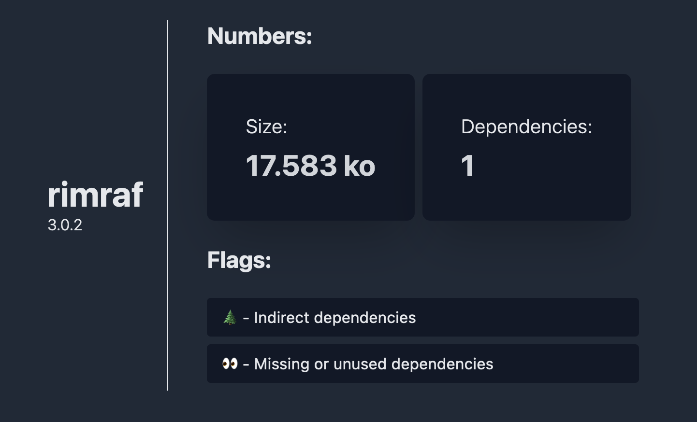

<h1 align="center">🕸 Preview</h1>
<h2 align="center">Light NodeSecure in browser</h3>
<p align="center">Find your package weaknesses!</p>



## ⚡️ Features

This project aims to help newcomers to understand the benefits of [NodeSecure](http://github.com/NodeSecure)

- 👩‍🚀 On demand analysis
- 🏋️‍♀️ Package size & dependency count
- ⛳️ Vulnerability flags
- 🕐 Browser caching
- 👑 Powered by [NodeSecure/scanner](http://github.com/NodeSecure/scanner)

## Contributing

First, install dependencies

```bash
$ npm i
```

Run the development server:

```bash
$ npm run dev
```

Open [http://localhost:3000](http://localhost:3000) with your browser to see the result.

Run e2e test:

```bash
$ npm run test:e2e
```
